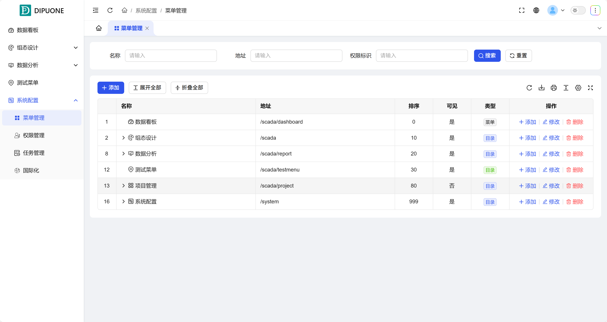
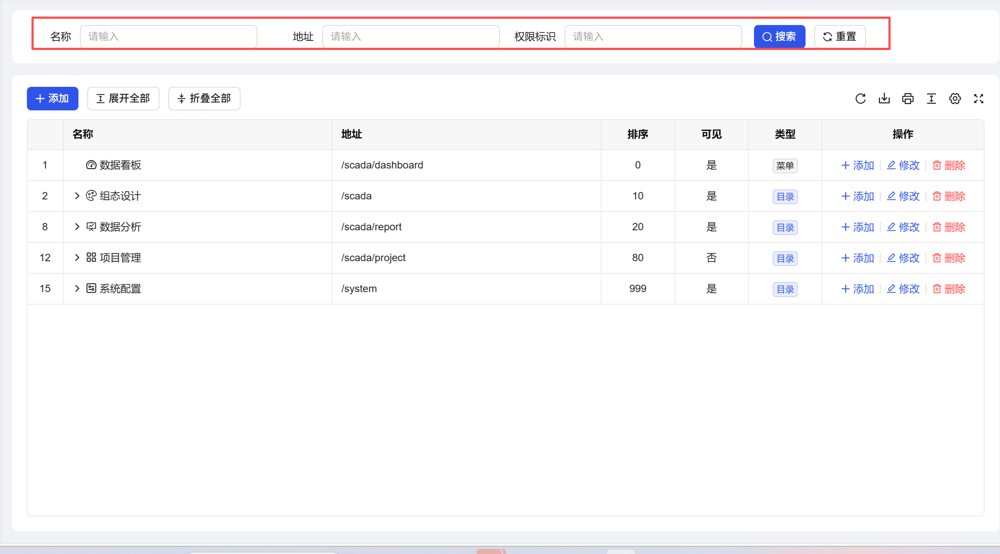
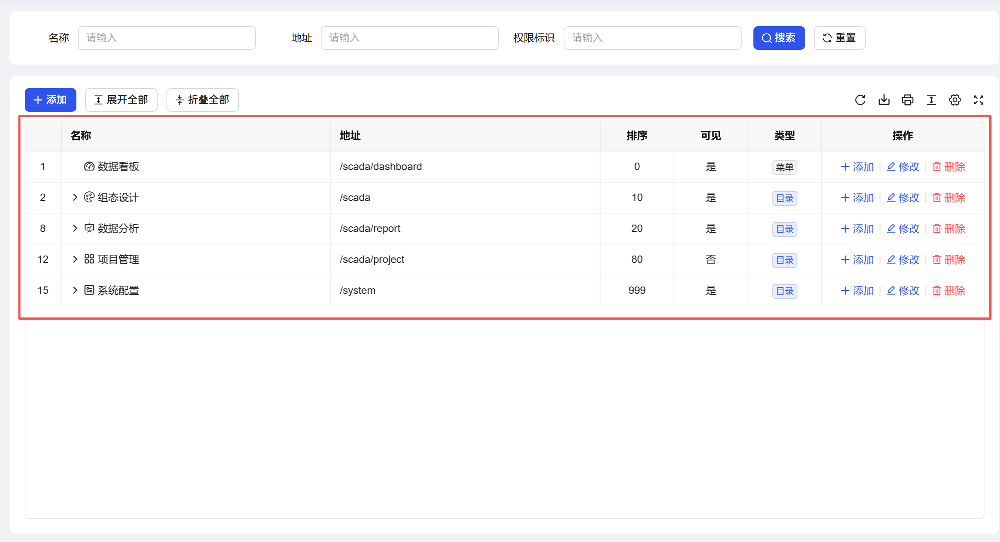

## 1. Overview

DipuCore provides menu management functions for system administrators to centrally manage and configure the system's navigation menu structure. It supports **multi-level menu nesting** and rich **menu attribute configuration**, making it a core tool for building a clear, secure, and maintainable system navigation system.

Figure 1-1

## 2. Interface and Function Details

### 1. Search and Filter Area

To quickly locate and manage a large number of menu items, powerful search and filter functions are provided at the top:

- **Search by Menu Name**: Enter name keywords to quickly find target menus.
- **Search by Route Address**: Precisely find corresponding menu items through the page's route path (URL).
- **Search by Permission Identifier**: Enter permission codes to accurately find menus bound to specific permissions, facilitating permission auditing.

Figure 1-2

### 2. Menu List Area

The list clearly displays the configuration details of all menu items. The main fields are as follows:

| Field Name | Description and Function                                                                                                           |
| ---------- | ---------------------------------------------------------------------------------------------------------------------------------- |
| Name       | The text title displayed by the menu item in the navigation bar.                                                                   |
| Address    | The page route path (URL) corresponding to this menu item. Clicking the menu will jump to this address.                            |
| Sort       | Weight value used to determine the display order of menus at the same level in the navigation bar. The smaller the value, the earlier the arrangement. |
| Visible    | Switch control that determines whether this menu item is visible to users in the navigation bar. Can be used to temporarily hide or conditionally display menus. |
| Type       | Distinguishes the type of menu: •Function Menu: Menu items that can be clicked directly to jump to pages. •Group Directory: A container (folder) used only to organize sub-menus, cannot be clicked itself. |
| Operations | Functional operation buttons provided for this menu item, including Add, Modify, Delete.                                           |

Figure 1-3

### 3. Menu Operation Function Area

Each row in the menu list provides three core operation buttons:

| Operation | Function and Process Description                                                                                                             |
| --------- | -------------------------------------------------------------------------------------------------------------------------------------------- |
| Add       | Create a sub-menu under the currently selected menu item. After clicking, the "Add Menu" form will pop up, as shown in Figure 1-4. Fill in name, address, icon, sort, and other configurations, then save. |
| Modify    | Modify various configuration parameters of the current menu item. After clicking, an edit form will pop up, as shown in Figure 1-5, where all menu attributes can be adjusted. |
| Delete    | Permanently remove menu items that are no longer needed. Note: This operation is irreversible, and if you delete a group directory, all its sub-menus will also be deleted. Please operate with caution. |

Through the above functions, administrators can flexibly build a hierarchical and permission-clear system navigation menu like building blocks, and achieve dynamic menu maintenance and updates.

Figure 1-4

Figure 1-5
