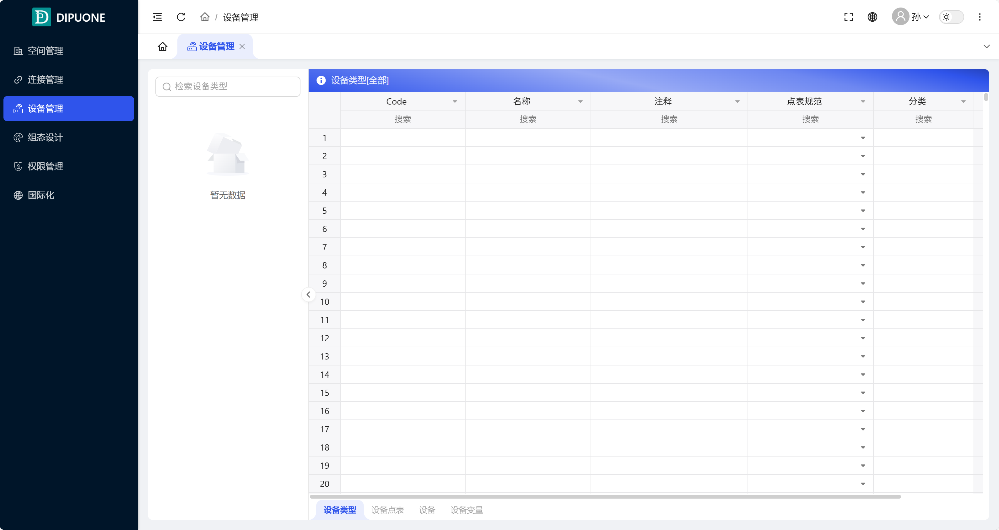
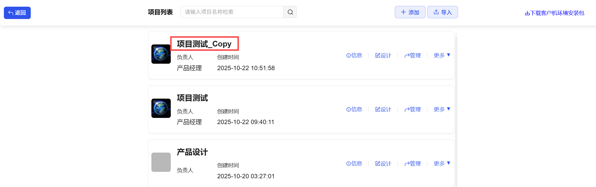
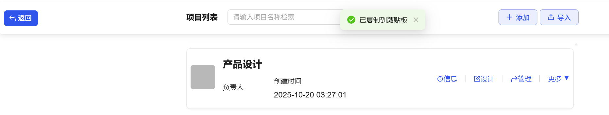
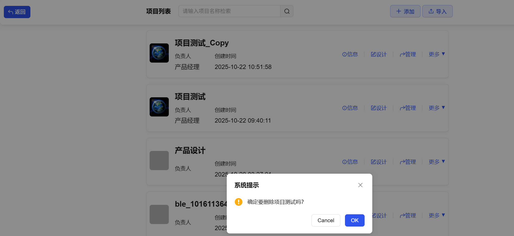

After successful login, users can open the project list by clicking "Create New Project", or directly open an existing project.

## Function Description

## Query

After clicking "Create New Project" and entering the project list page, users can view all projects in the current DipuOne system, which are arranged in reverse order of **creation time** by default.

Users can perform fuzzy searches on project names through the input box in the upper left corner.

## Add

Users can click the "Add" button in the upper right corner, fill in the project information, and then add a new project.

**Configuration Items**

| Configuration    | Description           |
| ---------------- | --------------------- |
| Name             | The name of the project |
| Image            | The display image of the project |
| Manager          | The name of the project manager |
| Manager Phone    | The phone number of the project manager |
| Description      | The description of the project |

## Information

Users can click the "Information" button on the right side of any project in the project list, and an information box will pop up containing project information: name, image, manager, manager phone, description. Project information can be modified and improved here.

## Design

Users can click the "Design" button on the right side of any project in the project list to jump to the configuration design page.

## Management

Users can click the "Management" button on the right side of any project in the project list to jump to the project management page. This page is divided into six functional modules: Space Management, Connection Management, Device Management, Configuration Design, Permission Management, and Internationalization. Detailed introductions to management functions can be found in subsequent chapters.

## More

When users hover the mouse over "More", it will display functions such as Download Client, Copy, Export, Share, and Delete.

## Download Client

Users can click the **Download Client** button to directly download the corresponding client through the browser.

## Copy

Users can click the "Copy" button on the right side of any project in the project list. After clicking copy, the project will be directly copied, with the default name "{*Original Project Name}_Copy"*.

After successful copying, a completely new project will be generated, with internal data exactly the same as the copied project.

## Export

The "More" button dropdown menu for any project data contains the **Export** option. Users can export and download any project data. The exported file is stored in the local download directory in zip format, which can be used as a project backup and for project synchronization between multiple nodes.

## Share

The "More" button dropdown menu for any project data contains the Share option. Users can share projects with other users. The Share button will generate a link, which is copied to the clipboard by default. When other users open it, they will see the running screen of this project. If the project has no running screen, it will prompt "This project has no runnable configuration screen".

## Delete

Users can move the mouse to the "**More**" button of any project to display more dropdown menu options.

After users click the "**Delete**" button, a delete confirmation dialog will pop up. After clicking **Confirm**, the selected project data will be deleted.

Note: Deletion cannot be undone. Please delete with caution.

## Import

Users can click the **Import** button in the upper right corner to import previously exported .zip files into the DipuCore system.

