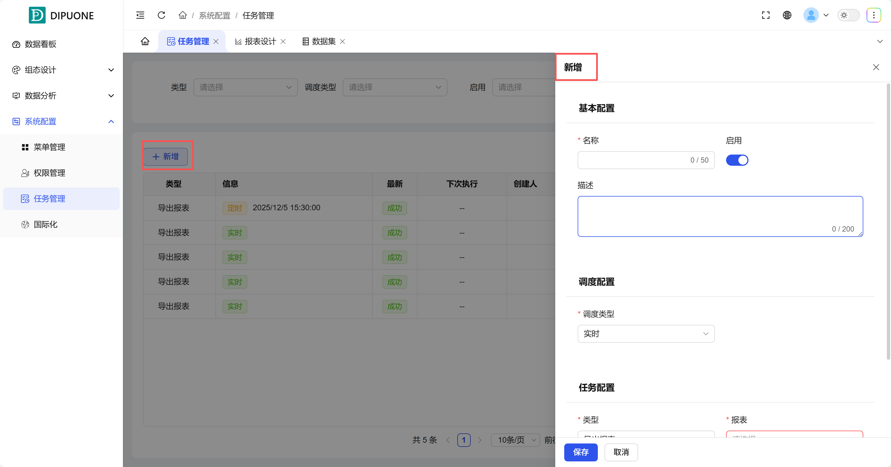
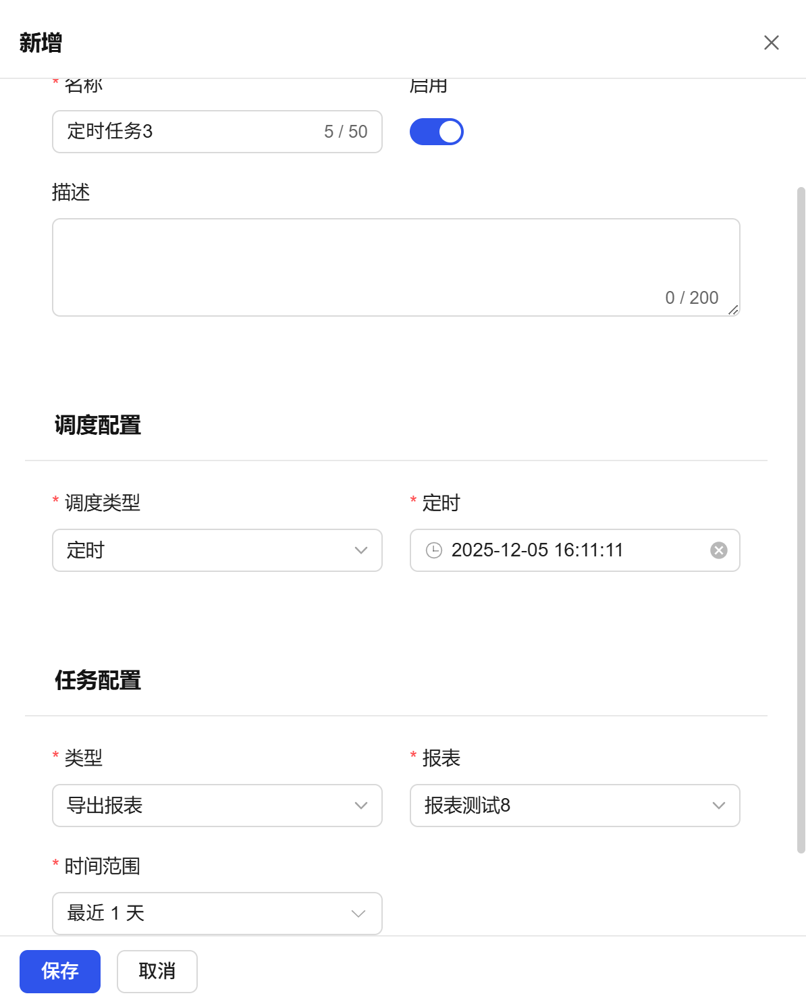

## 1. Overview

The Task Management module is mainly used to meet users' needs for **scheduled or periodic automatic report export**, while providing complete **export log recording** functions, making it convenient for users to track task execution status, view historical records, and download generated report data.

## 2. How to Create Scheduled Tasks and Export Data

### 1. Create New Task

Click the **"Add"** button to enter the task configuration page.

- **Task Name**: Enter the name of this scheduled task.
- **Enable Status**: Control whether the task is executed through the **"Enable"** switch.
- **Report Selection**: In the task configuration, select the **target report (from Data Analysis - Report Design)** that needs to be exported on schedule.
- **Data Time Range**: For the selected report, set the **data time range** covered each time it is exported (such as: export yesterday's full-day data, export the last hour's data, etc.).

### 2. Configure Scheduling Strategy (When to Execute)

In **"Scheduling Configuration"**, select the execution method of the task. There are three types:

| Scheduling Type | Description and Configuration                                                                                                          |
| --------------- | -------------------------------------------------------------------------------------------------------------------------------------- |
| Real-time       | Execute once immediately. After the configuration is saved, the task will run immediately and export data.                           |
| Scheduled       | Execute once at a set future time point. Can configure specific year, month, day, hour, minute, second.                                |
| Periodic        | Periodically repeat execution within a set time range. Can be configured to execute cyclically by minute, hour, day, week, month, etc. For example: export the previous day's report at 2 AM every day. |

After the configuration is completed and saved, the task will automatically run according to the set strategy.

## 3. Task Logs and Records

This module provides execution logs for all report export tasks for monitoring and auditing.

### Menu List Area (Log Field Description)

| Field Name | Description                                                   |
| ---------- | -------------------------------------------------------------- |
| Name       | The task name of the exported report.                          |
| Type       | The type of task (export report).                              |
| Information | The information of the task (scheduled, real-time).            |
| Latest     | The status of the task (success, failure)                      |
| Next Execution | The scheduled next execution time of the task (for periodic tasks). |
| Creator    | The creator of this task.                                      |
| Created Time | The creation time of the task.                                 |
| Description | Supplementary description or notes for this task.              |
| Enabled    | Whether the task is enabled                                    |
| Operations | Task modification, log viewing, data download, task deletion, and other functions |

Through this log list, users can clearly grasp the execution status of all export tasks. For successful tasks, they can directly download the generated report files; for failed tasks, they can view error information to troubleshoot problems.

Through the download function, users can persistently save query results for offline analysis, data archiving, report submission, or data exchange with other systems.

