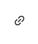
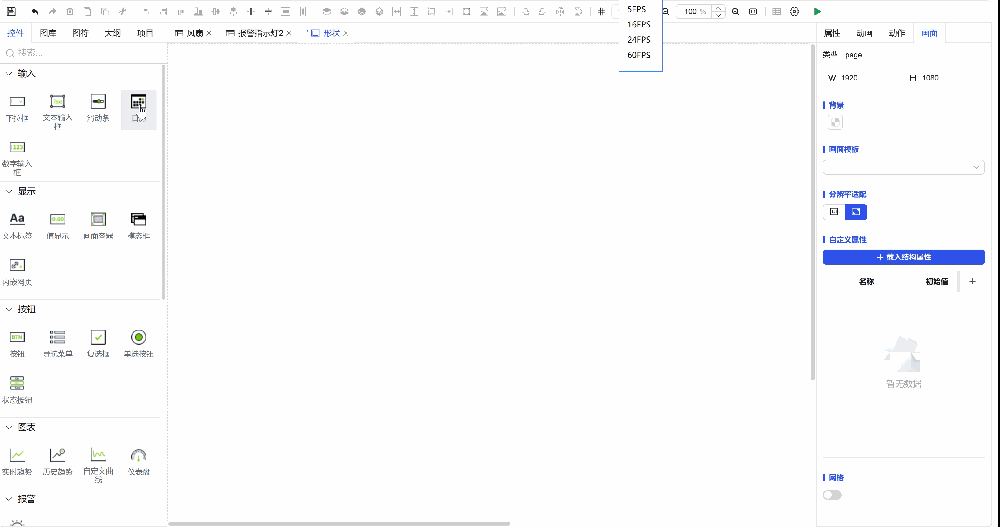

## 一、概念

属性绑定是实现控件间智能联动的关键功能，它允许您将一个控件的某个属性值直接关联到另一个控件的属性上。通过这种绑定关系，可以在控件之间建立数据或状态的自动同步机制。

属性绑定是将一个控件的属性绑定到另一个控件上。当该属性发生更改时，新值将推送到设置了绑定的属性中。

## 二、核心原理

### 1.单向数据流

- **驱动与被驱动**：当一个控件（源控件）的特定属性值发生变化时，这个新值会自动推送给与之绑定的另一个控件（目标控件）的对应属性。
- **实时同步**：实现了控件属性值的实时传递与同步，无需编写额外的逻辑代码。

### 2.选择性绑定

- **并非所有属性都支持**：出于设计规范与性能考虑，**并非所有控件属性都开放了绑定功能**。通常，那些直接影响视觉呈现、交互状态或核心数据的属性（如文本、值、可见性、启用状态、颜色等）才支持绑定。
- **标识说明**：在属性面板中，**支持绑定的属性旁通常会显示一个特殊的绑定图标（链环，如下图1-1所示），**以提示用户此属性可建立联动关系。

图 1-1

## 三、操作流程

1. **选择目标属性**：在需要接收数据的控件（目标控件）属性面板中，找到并点击支持绑定的属性旁的绑定图标。
2. **选择绑定源**：在弹出的绑定设置窗口中，选择作为数据源的另一个控件及其特定属性。
3. **确认绑定**：完成设置后，两者间的单向数据通道即建立。源属性的任何变化都将自动更新目标属性。

**注意**：属性绑定建立的通常是**单向**数据流（从源到目标）。若需要双向同步，需根据具体控件的特性进行配置或使用其他数据管理方式。

**示例：**

图 1-2
