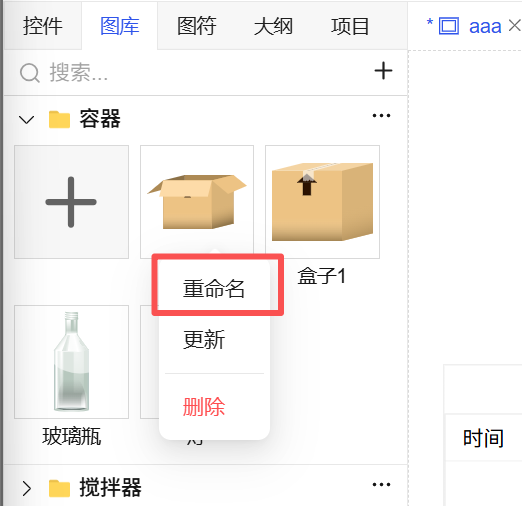

## 一、概述

图库是项目中图片资源的集中管理中心，通过“图库”窗口，您可以对图片进行系统化的上传、分类和管理。支持上传 **SVG、PNG、JPEG、GIF、JPG** 等主流图片格式。上传后的图片可在**画面编辑、模板设计以及图符创建**中直接使用。

## 二、图库操作

### 1. 新增图库

- **操作路径**：在“图库”窗口中，点击 **“+”** 按钮。
- **执行结果**：系统将自动创建一个新的图库，且**库名处于可编辑状态**。
- **后续操作**：修改库名后，可单击该图库内的“添加”按钮上传图片。

图 1-1

### 2. 删除图库

- **操作路径**：点击已建图库**右上角的三个点**菜单按钮。
- **执行结果**：选择“删除”操作，即可删除当前图库及其包含的所有图片。
- **注意**：删除前请确认，此操作不可撤销。

图 1-2

### 3. 上传图片

- **操作路径**：在图库内，点击 **“添加”** 按钮。
- **执行流程**：

  - 系统将弹出“打开文件”对话框。
  - 在本地计算机中**选择一张或多张**图片（支持多选）。
  - 点击对话框的 **“打开”** 按钮。
- **执行结果**：所选图片将上传至当前图库。

图 1-3

## 三、图片操作

### 1. 重命名图片

- **操作路径**：在图库中，**右键点击**需要重命名的图片。
- **执行结果**：在菜单中选择“重命名”，输入新名称后确认即可。

### 2. 更新图片

- **操作路径**：在图库中，**右键点击**需要替换的图片。
- **执行结果**：在菜单中选择“更新”，重新选择一张本地图片上传，**新图片将覆盖旧图片**，而图片在项目中的引用关系保持不变。

### 3. 删除图片

- **操作路径**：在图库中，**右键点击**需要删除的图片。
- **执行结果**：在菜单中选择“删除”，即可从当前图库中移除该图片。

图 1-4

## 四、使用图片

图片上传至图库后，使用非常简单：

1. 打开需要使用图片的画面、模板或图符编辑器。
2. 从“图库”窗口中，找到并选中目标图片。
3. **直接将图片拖拽到**画布上的目标位置，即可完成放置。

图 1-5
