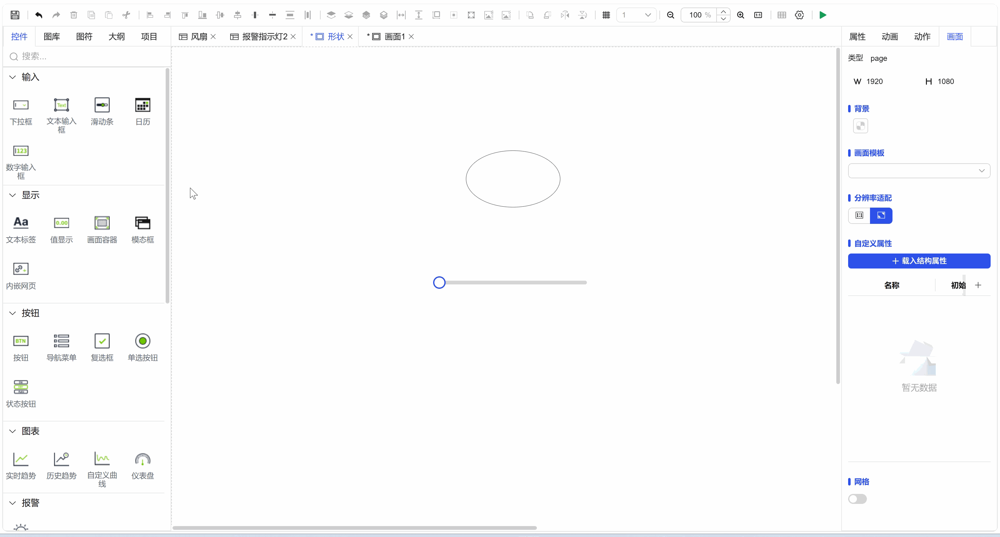

## 一、概述

脚本绑定为您提供了最高级别的数据绑定与控制灵活性。通过在集成的脚本编辑器中编写代码，您可以创建复杂的逻辑规则、进行动态计算、处理多源数据融合，从而实现超越标准属性绑定的高级值绑定功能。

## 二、工作原理

1. **触发与执行**：脚本可以设置为在特定事件触发时执行（如变量值变化、画面加载、定时器到期等）。
2. **逻辑处理**：在脚本中，您可以访问系统中的变量、控件属性及其他对象，并执行您定义的逻辑。
3. **输出绑定**：将脚本的最终计算结果，赋值给一个或多个控件的目标属性，完成值的绑定与更新。

## 三、使用方法

1. 为目标控件选择支持脚本绑定的属性。
2. 打开脚本编辑器，在其中编写您的业务逻辑代码。
3. 在脚本末尾，将计算出的值赋值给特定的目标属性。
4. 保存脚本。

**提示**：脚本绑定功能强大，建议使用者具备基础的编程知识。对于简单关联，优先使用变量绑定，属性绑定以提升性能和可维护性。

**示例：**

图 1-1
