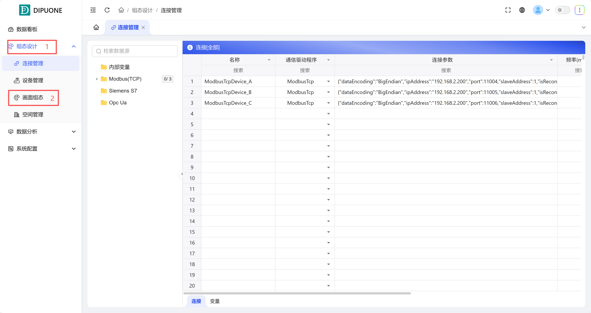
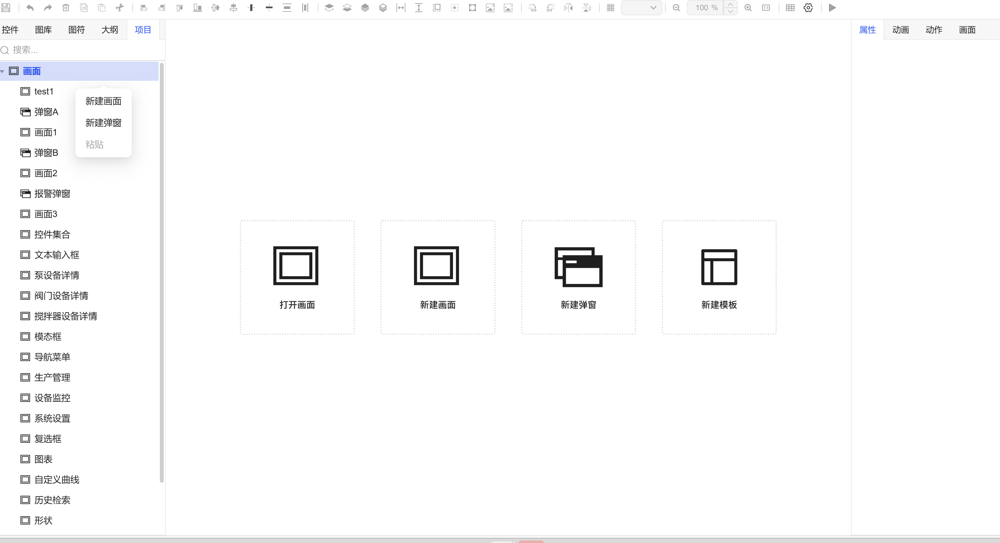
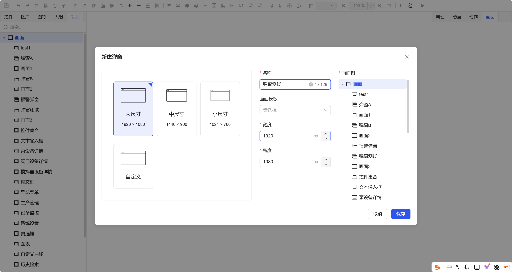
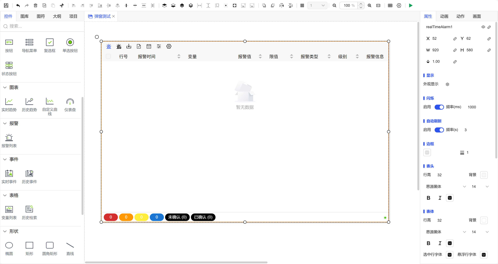
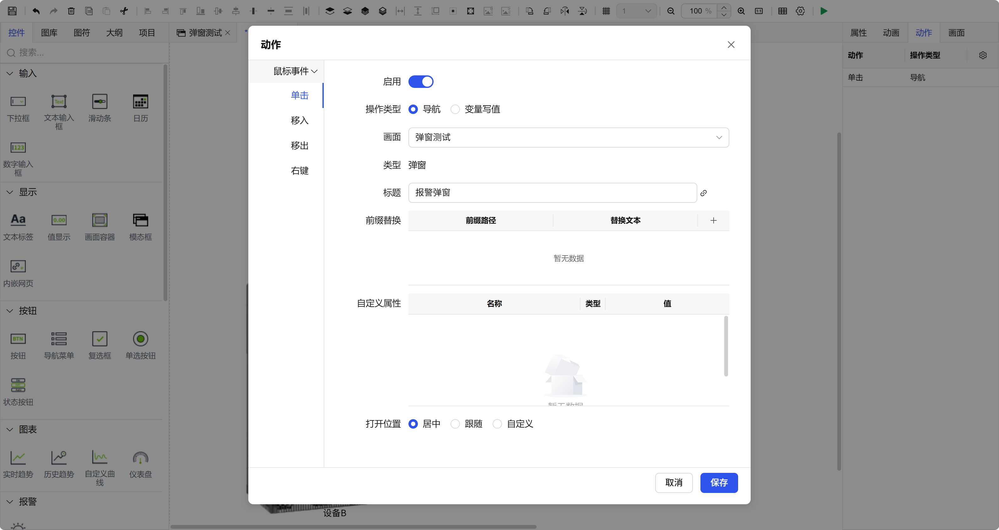
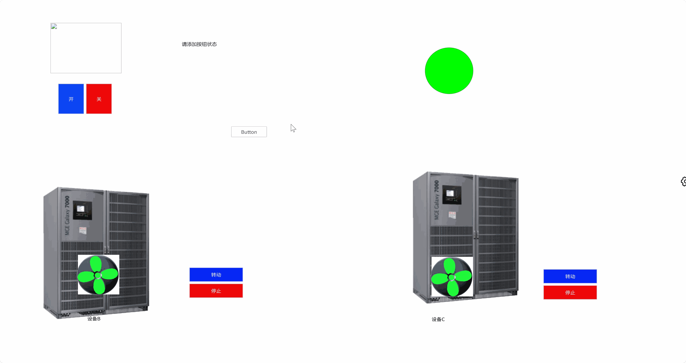

## 一、概述

弹窗（模态对话框）是一种重要的交互组件，用于在不离开当前画面的情况下，展示详细信息、进行参数设置或完成特定操作。本案例将详细介绍在 DipuOne 中从创建到使用一个弹窗的完整流程。

## 二、操作步骤

### 步骤1：进入组态设计界面

1. 在项目管理界面，找到并点击 **“组态设计”** 模块。
2. 进入后，选择 **“画面组态”**，打开组态设计编辑器。

图 1-1

### 步骤2：创建新弹窗

您可以通过以下两种方式之一创建新弹窗：

- **方式一**：在画布中，选择**“新建弹窗”** 。
- **方式二**：在左侧“项目”窗口的“画面”列表上**右键点击**，选择 **“新建弹窗”**。

图 1-2

### 步骤3：配置弹窗属性

在弹出的“新建弹窗”配置窗口中，进行以下设置：

1. **选择尺寸**：从预设尺寸中选择，或自定义弹窗的宽度和高度。
2. **填写名称**：为弹窗输入一个清晰的名称（如“设备详情设置”）。
3. **选择模板（可选）**：如果项目中有预定义的画面模板，可以选择一个以快速应用统一样式。
4. 点击 **“保存”**，完成弹窗创建。

图 1-3

### 步骤4：设计弹窗内容

新弹窗将以一个独立的设计窗口打开。在此窗口中，您可以像设计普通画面一样：

- 从 **“控件”** 面板拖拽所需控件（如输入框、按钮、下拉列表）。
- 从 **“图库”** 中拖拽图片作为背景或装饰。
- 从 **“图符”** 库中拖拽复用组件。
- 自由布局，设计出您期望的弹窗样式和功能。

图 1-4

### 步骤5：在主画面中触发弹窗

1. 返回或切换到需要触发弹窗的**主画面**。
2. 选中用于触发弹窗的控件（例如一个**按钮**）。
3. 在右侧 **“动作”** 属性栏中，点击“添加动作”。
4. 配置动作：

   1. **触发事件**：选择 **“单击”**。
   2. **执行动作**：选择 **“导航”** -> **“弹窗”**。
   3. **目标弹窗**：从列表中选择您在**步骤3**中创建的弹窗。
5. 根据需要，可进一步配置弹窗的打开位置、标题或自定义属性绑定。
6. 点击 **“保存”**，完成主画面的设置。

图 1-5

### 步骤6：运行与测试

1. 点击编辑器的 **“预览”** 或项目列表的 **“运行”** 按钮，进入运行模式。
2. 在运行的主画面中，**点击**您设置了动作的按钮。
3. 此时，之前设计好的弹窗将按预设方式弹出，您可以测试其中的交互功能。

图 1-6
