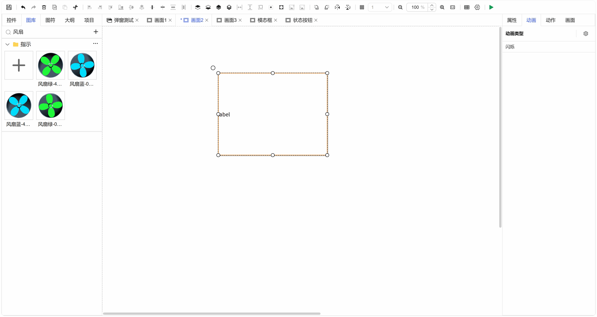

## 一、概述

动画效果能够显著提升界面的动态表现力和状态感知度。本案例将以**文本标签**控件为例，演示如何配置一个简单的“闪烁”动画，实现两种图片的交替显示，模拟设备运行状态。

## 二、操作步骤

### 步骤1：选择控件并启用动画

1. 在画布上放置或选择一个可以显示内容的控件，本案例选择**文本标签**控件。
2. 在右侧属性面板中找到 **“动画”** 属性栏。
3. 点击 **“闪烁”** 右侧的开关，将其设置为 **“启用”** 状态。

图 1-1

### 步骤2：配置“闪烁显示”状态

1. 点击 **“闪烁显示”** 旁的设置按钮，进入该状态的详细配置。
2. 在“背景类型”中，选择 **“图片”**。
3. 点击图片选择框，从图库中选择一张图片，例如：**风扇绿-0°.png**。此图片将在控件“显示”时呈现。

图 1-2

### 步骤3：配置“闪烁消失”状态

1. 点击 **“闪烁消失”** 旁的设置按钮，进入该状态的详细配置。
2. 同样在“背景类型”中，选择 **“图片”**。
3. 点击图片选择框，从图库中选择另一张图片，例如：**风扇绿-45°.png**。此图片将在控件“消失”时呈现。两张图片的差异将构成动态效果。

图 1-3

### 步骤4：绑定动画触发变量

1. 在动画属性的顶部，找到控制动画启停的 **“变量”** 绑定框。
2. 点击绑定按钮，将其绑定到一个**布尔型（Boolean）变量**上，并将该变量的值设置为 `true`。
3. **原理说明**：当绑定的变量值为 `true` 时，控件将开始按照设定的频率在“闪烁显示”和“闪烁消失”两种状态间循环切换，形成动画效果；当变量值变为 `false` 时，动画停止。

图 1-4

### 步骤5：运行与测试

1. 进入**预览**或**运行**模式。
2. 确保控制动画的变量值为 `true`。
3. 观察文本标签控件，您将看到其背景在 **风扇绿-0°.png** 和 **风扇绿-45°.png** 两张图片之间交替闪烁，从而模拟出风扇旋转的动态视觉效果。

