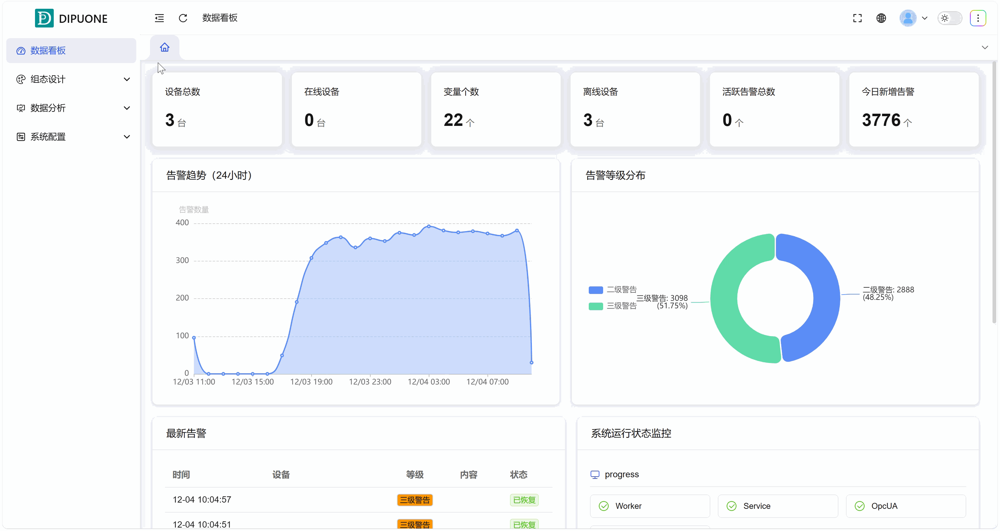
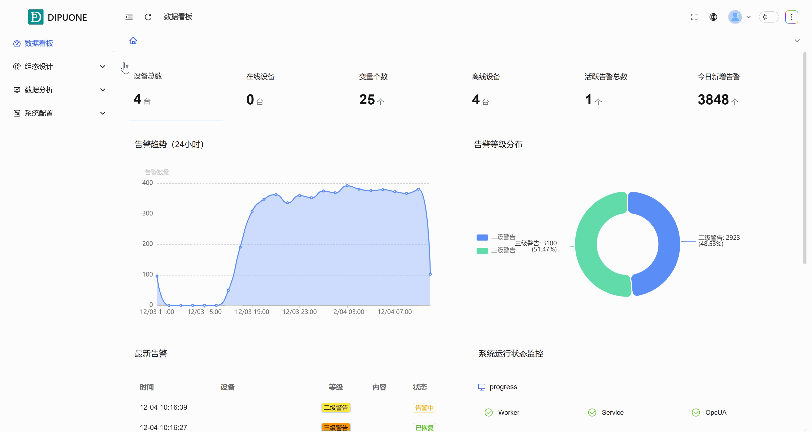
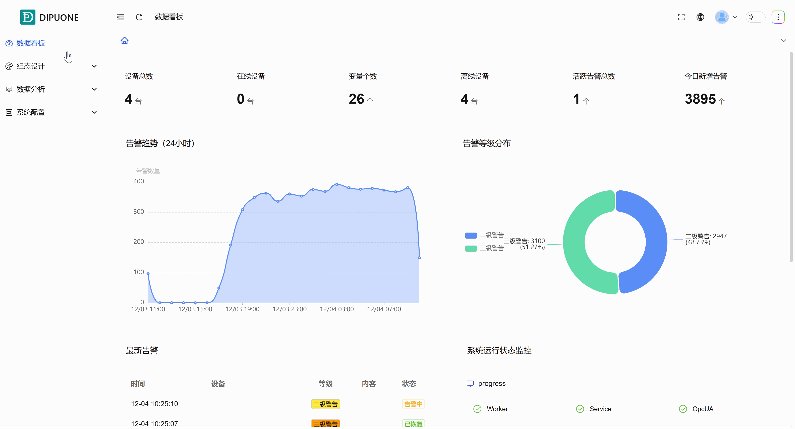

## 一、概述

变量是组态系统数据驱动的核心，分为**结构变量**、**非结构变量**和**内部变量**。本案例将引导您完整掌握这三种变量的创建方法。

## 二、操作步骤

### **路径一：创建结构变量（基于设备类型）**

此路径适用于为同一型号设备批量创建标准化的变量组。

1. **创建设备类型与点表**

   1. 进入 **设备管理** -> **设备类型** 页面。
   2. 点击“新建”，输入设备类型名称（如 `Device4`）。
   3. 选择合适的**点表规范（通常默认为“通用**”）。
   4. 编辑**设备点表**，定义该类设备的标准数据点（如：温度、压力、状态等）。这些点将成为变量的模板。
2. **配置通信连接**

   1. 进入 **连接管理** 页面。
   2. 点击“连接”，选择通信协议（如 `Modbus TCP`），新建具体的连接。
   3. 配置IP、端口等必要参数并保存。
3. **新建具体设备（实例化）**

   1. 返回 **设备管理**页面，选择某个设备类型，这里点击选择1中已创建的 `Device4`。
   2. 点击“设备”，输入设备具体信息。
   3. 在“设备”中的连接属性中选择已配置好的 `Modbus TCP` 连接。
   4. 保存设备。
4. **查看自动生成的结构变量**

   1. 进入 **设备变量** 页面。
   2. 系统会根据设备类型的点表，自动为该具体设备生成一套**结构变量**。这些变量具有标准的名称和结构。

图 1-1

### **路径二：创建非结构变量（设备专属变量）**

此路径适用于为具体设备添加其独有的、不在标准点表中的变量。

1. **进入变量管理**

   1. 在 **连接管理** 页面下，找到并点击 **变量** 子页面。
2. **新建非结构变量**

   1. 点击“新建”，创建一个新变量。
   2. 为这个变量命名，并设置其数据类型。
   3. **关键步骤**：在变量属性的 **“连接/设备”** 选项中，**选择该变量所属的具体设备**（例如上一步中创建的设备）。
   4. **关键步骤**：在 **“驱动”** 选项中，**选择该设备对应的通信驱动**（例如 `Modbus TCP`）。
   5. 配置该变量在驱动下的具体地址、读写方式等参数后保存。
   6. 此类变量被称为**非结构变量**，它归属于特定设备，但不是从设备类型的标准点表继承而来。

图 1-2

### **路径三：创建内部变量**

此路径用于创建不依赖于任何外部设备的、系统内部的变量。

1. **进入内部变量管理**

   1. 在 **连接管理** 页面下，切换到 **变量** 子页面。
2. **新建内部变量**

   1. 点击“新建”，填写变量的**名称、数据类型、初始值**等。
   2. 保存后，该变量即可在项目中用于存储中间结果、全局标志或配置参数。

图 1-3
