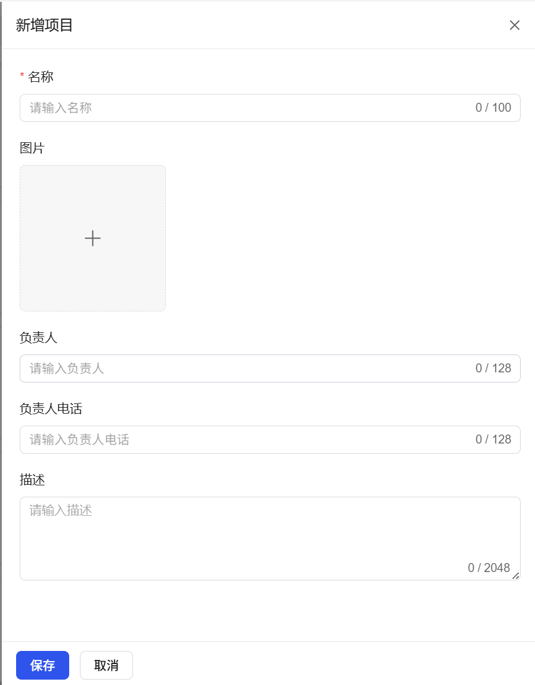
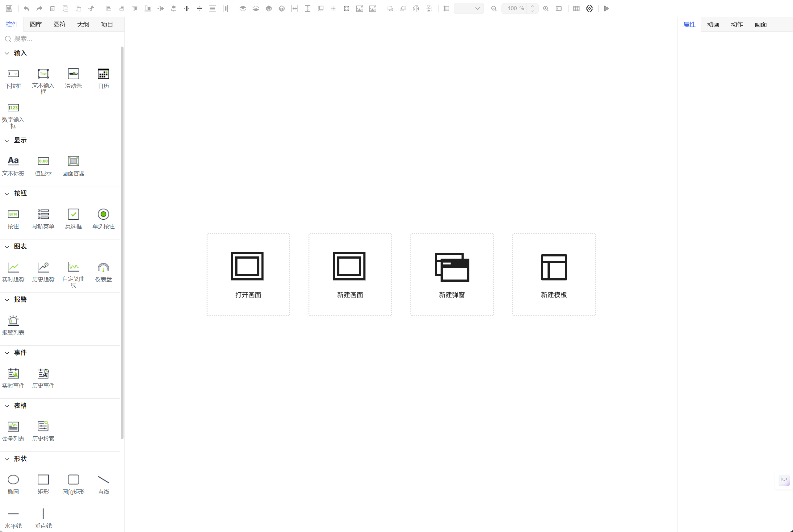
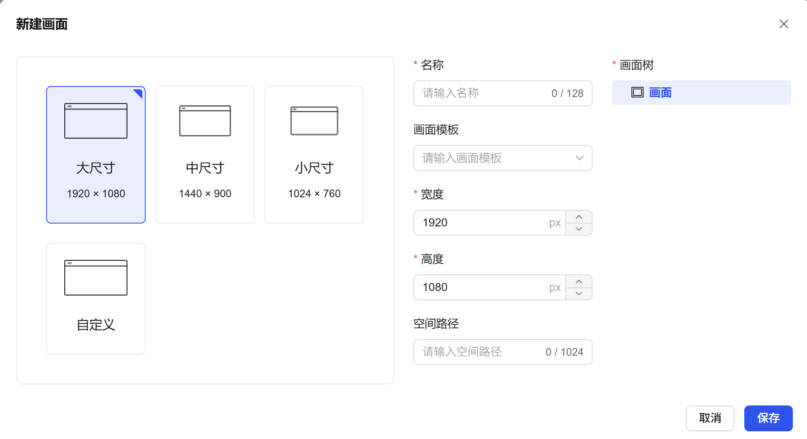
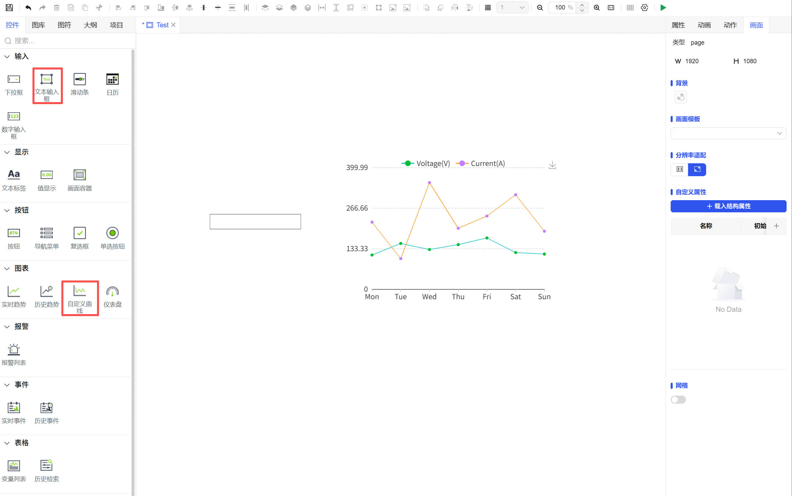
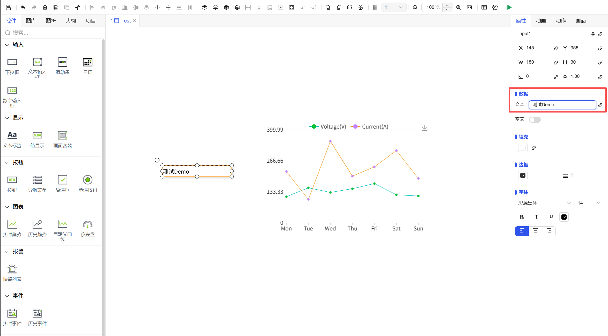
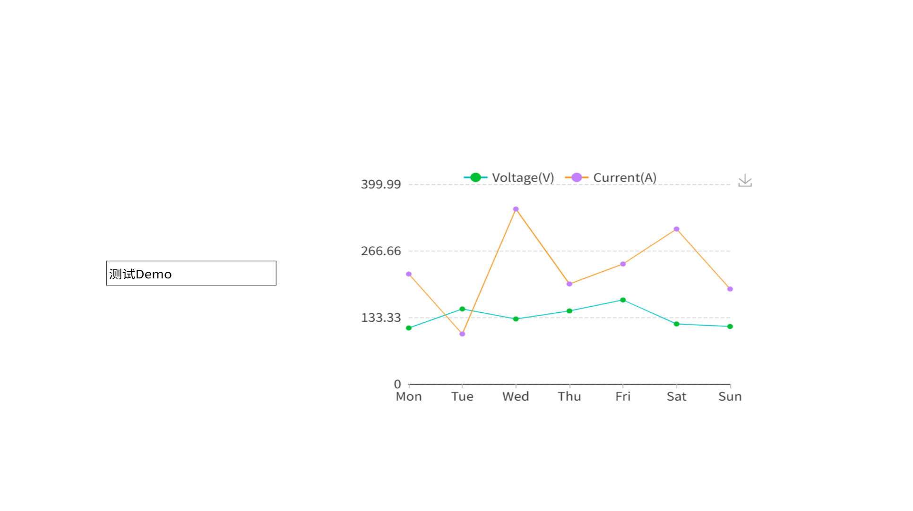

我们概述了一些简单的步骤来指导您配置项目。您可以在短时间内，运行一个项目。

### 1.创建项目

在项目列表中点击“新增“按钮来创建项目。

在新增页面填入”项目名称”必填项，可快速创建项目，项目图片、负责人、负责人电话、描述为非必填项

### 2.打开编辑器

在项目列表页面，点击项目的”设计“按钮。

打开组态编辑器，显示如下界面

### 3.新建画面

点击”新建画面“，快速创建一个画面。

在设计器右侧的工具窗口中，在画面上添加”文本输入框”,”自定义曲线”控件。

选中文本输入框，在右侧属性栏中输入文本“测试Demo”，注意所有对画面的更改都需保存方可在运行时生效。

### 4.预览运行

点击画面菜单栏中的预览按钮，查看预览效果。也可以在项目列表中，点击项目的运行按钮，查看运行页面。

